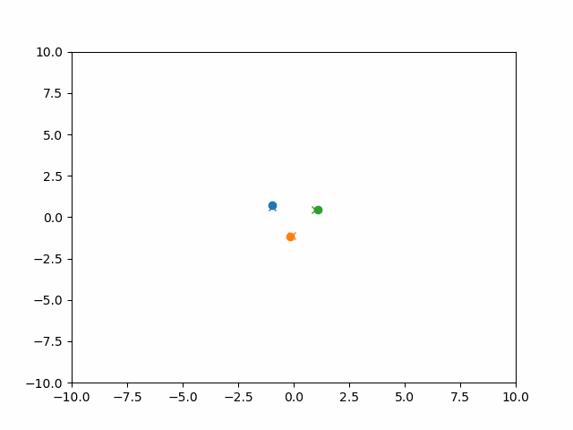

# Foreword
See master.ipynb for the jupyter notebook outlining our findings. Note it may be beneficial to collapse the code blocks as they are very lengthy. Our examples are included in examples/ and our data generation is found in data.py. We include a sample below:

# Modeling The Three Body Problem with Symmetries
In this project we sought to model the three body problem by incorporating different symmetries into the neural network. We use a couple of different methods for making predictions on the three body problem. First we try developing a Hamiltonian Neural Network [1] and train it to directly predict the acceleration and velocity at each time step. However, Hamiltonian ODEs rely on training using the ground truth of acceleration which greatly simplifies the problem. As in this case, the acceleration is a simple inverse square function of the inputs. Furthermore, the acceleration may be unknown when studying more complicated systems. As a result we develop several Neural ODEs [2] that model the data only using the ground truth of position and velocity. We also incorporate several symmetries into the problem using techniques from [3].

We would not recommend re-running some of these cells. The Hamiltonian Neural Networks only take about 3-4 minutes to run, but some of the Neural ODEs were trained for hours on the BYU super computer with much better GPUs. We have included several folders with simulations of the three body problem for various architectures.

## Literature Review
[1] Sam Greydanus, Misko Dzamba, & Jason Yosinski. (2019). Hamiltonian Neural Networks.

This works seeks to learn differential equations that model Hamiltonian systems. Many different systems can be fully characterized by the energy equation called the Hamiltonian. The Hamiltonian not only predicts the energy of a system but its derivatives predict both change in momentum and change in position. In this work, they train a neural network that predicts the hamiltonian of a system by backpropagating to make the partial derivatives of the network match the change in momentum and positions of the hamiltonian.

In their work they predict energies of several different systems: The ideal mass spring, ideal pendulum, and the real pendulum. They also try to model the two and three body problem but are unable to get very good results with the three body problem. We use portions of their code when generating the datasets for our three body problem.

[2] Ricky T. Q. Chen, Yulia Rubanova, Jesse Bettencourt, & David Duvenaud. (2019). Neural Ordinary Differential Equations.

This work proposes using ODE solvers as a version of residual connections for neural networks. The inspiration for this is that residual connections look a lot like forward euler integration. Their idea was to use feedforward neural network as the update equation in the ODE solver and then backpropagate through the ODE solver. However, backpropagating through an ODE solver can be very costly. So as a result, they propose an adjoint method that allows us to not have to differentiate all the way through the ODE solver and do backpropagation in $O(1)$ time.  Additionally, they model time series using a Latent Neural ODE that is able to filter out noise using a Variational Auto-Encoder.

In our work we do not use the adjoint method they propose. This is because we found it took much longer than just backpropagating through the solver initially.

[3] Soledad Villar, David W. Hogg, Kate Storey-Fisher, Weichi Yao, & Ben Blum-Smith. (2023). Scalars are universal: Equivariant machine learning, structured like classical physics.

This paper shows that non-linear group equivariant functions are universally expressed as linear combinations of the scalar, vector, and tensor inputs. They prove how different functions that are equivariant to some group action must be represented. Importantly they show how functions that are translationally, rotationally, and permutation equivariant must be represented as linear combinations of predicted scalers and input vectors. Using this framework they explore several examples of how they can learn some arbitrary function with a neural network by hardcoding in the equivariance.

This paper is very important to our problem. They prove how our functions must be represented in order to be invariant under some group action. We incorporate their methods when developing symmetries for the three body problem and see some awesome results.

[4] Behrooz Tahmasebi, & Stefanie Jegelka (2023). The Exact Sample Complexity Gain from Invariances for Kernel Regression. In Thirty-seventh Conference on Neural Information Processing Systems.

This work examines the exact sample complexity gains from encoding invariances into a model. They study this in the specific example of kernel ridge regression, but state that it heuristically looks very similar in the neural network case. They show that when you train m samples under a certain invariant finite group G, you are essentially training on $m|G|$ samples. In the infinite case they find that by increasing the size of the group you reduce the exponent on the expected emperical risk.

Applied to our problem, if we incorporate translational, rotational, and permutation equivariance we should expect that our expected risk should be proportional to $(\frac{\text{Vol(possible data)}}{6m})^{\frac{s}{s+3/2}}$ where s is the p-norm of the space of sobelev functions we are considering.

